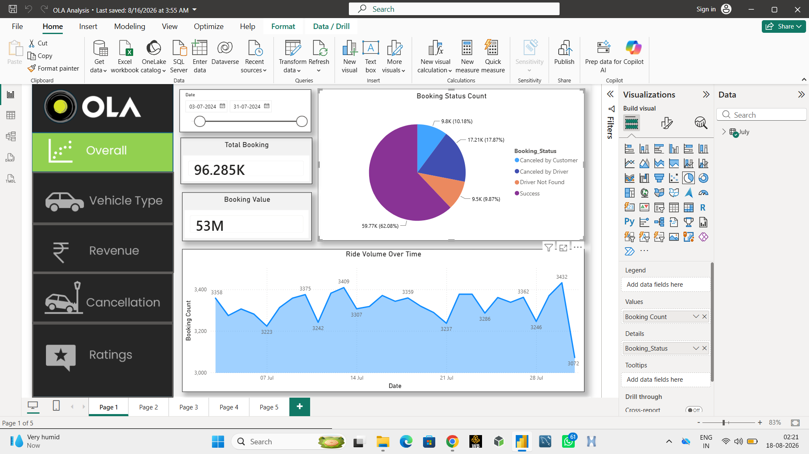
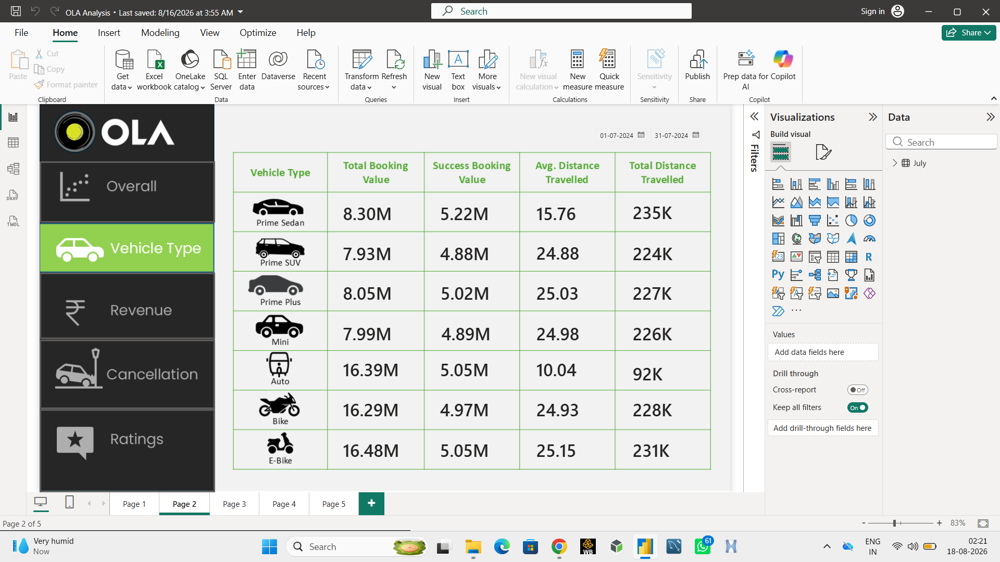
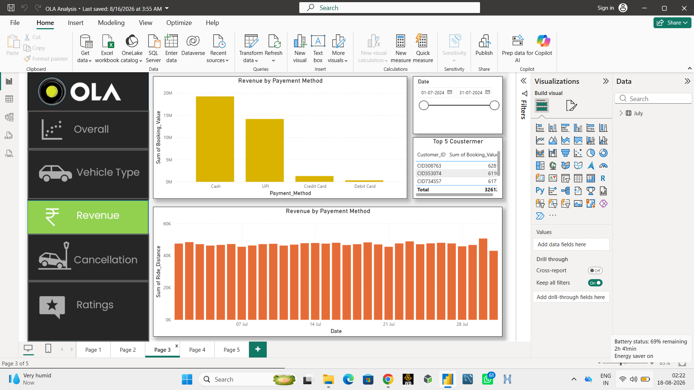
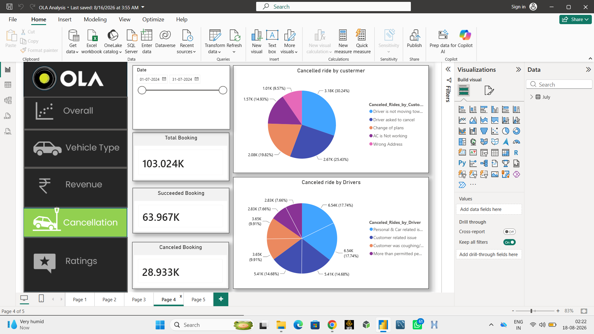
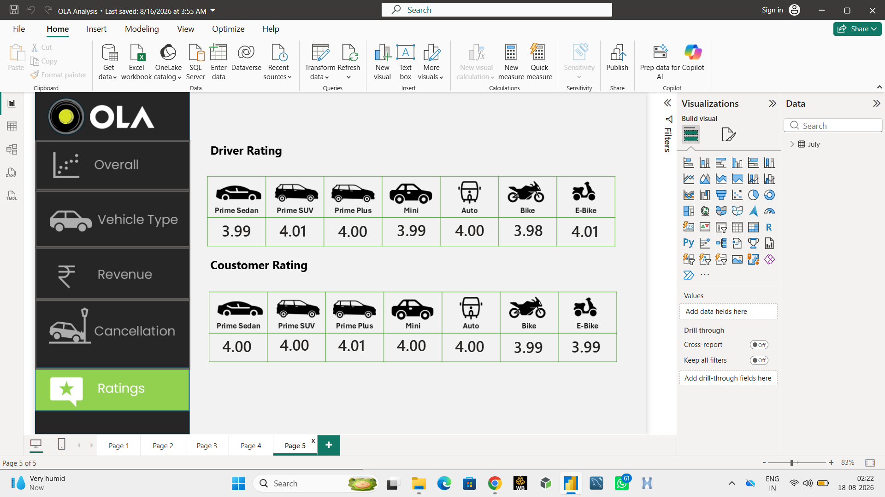

# Ola Ride-Hailing Data Analysis Project

## Project Overview
This project presents a comprehensive data analysis of Ola's ride-hailing operations for the month of July 2024. By leveraging SQL for data extraction and Microsoft Power BI for interactive visualization, this analysis evaluates overall business health, revenue performance, vehicle utilization, cancellation root-causes, and service quality metrics.

The goal of this project is to provide data-driven insights to optimize operational efficiency, reduce ride cancellations, and maximize revenue generation.

---

## Table of Contents
1. [Project Objectives](#project-objectives)
2. [Dataset Description](#dataset-description)
3. [Tech Stack & Tools](#tech-stack--tools)
4. [Analysis Methodology](#analysis-methodology)
5. [Key Performance Indicators (KPIs)](#key-performance-indicators-kpis)
6. [Dashboard Visualizations](#dashboard-visualizations)
7. [Key Business Insights](#key-business-insights)
8. [Future Recommendations](#future-recommendations)
9. [How to Use This Repository](#how-to-use-this-repository)

---

## Project Objectives
- To measure total ride volume, booking success rates, and generated revenue.
- To identify top-performing vehicle types based on total booking value and distance traveled.
- To analyze revenue distribution across different payment methods (Cash, UPI, Credit/Debit Card).
- To uncover primary reasons for ride cancellations initiated by customers and drivers.
- To evaluate service quality by comparing average driver ratings and customer ratings per vehicle type.
- To identify high-value customers for future retention and loyalty programs.

---

## Dataset Description
The raw dataset consists of transactional booking logs from July 1, 2024, to July 31, 2024. Key columns in the dataset include:

- **Booking Information:** Date, Time, Booking_ID, Booking_Status (Success, Cancelled by Customer, Cancelled by Driver, Driver Not Found).
- **Customer & Vehicle Info:** Customer_ID, Vehicle_Type (Auto, Prime Plus, Prime Sedan, Mini, Bike, E-Bike, Prime SUV).
- **Operational Metrics:** V_TAT (Vehicle Time to Arrive), C_TAT (Customer Time to Arrive), Pickup Location, Drop Location, Ride Distance.
- **Financial Data:** Booking_Value, Payment_Method.
- **Quality Metrics:** Driver_Ratings, Customer_Ratings.
- **Cancellation Details:** Cancelled_Rides_by_Customer, Cancelled_Rides_by_Driver, Incomplete_Rides, Incomplete_Rides_Reason.

> **Data Constraints:** Data such as ride distance and ratings are only present for successfully completed rides. Cancelled and incomplete rides have null values in these specific fields.

---

## Tech Stack & Tools
- **Database Management:** MySQL
- **Data Querying:** Structured Query Language (SQL)
- **Data Visualization:** Microsoft Power BI
- **Version Control:** Git & GitHub

---

## Analysis Methodology
1. **Data Extraction & Cleaning:** SQL queries were used to create filtered views and aggregate datasets (e.g., `Create View Successful_Bookings`).
2. **Aggregation:** Data was grouped by vehicle type, payment method, and date to calculate averages, sums, and counts.
3. **Visualization:** Interactive dashboards were built in Power BI to visually segment the data into five core categories: Overall, Vehicle Type, Revenue, Cancellations, and Ratings.

---

## Key Performance Indicators (KPIs)
The following high-level metrics were established to track business health:
- **Total Booking Requests:** 103.02K
- **Successful Bookings:** 63.96K
- **Total Booking Value (Revenue):** 53 Million Rupees
- **Overall Success Rate:** 62.08%
- **Total Cancelled Bookings:** 28.93K
- **Average Driver Rating:** 3.98 - 4.01 (across vehicle types)
- **Average Customer Rating:** 3.99 - 4.01 (across vehicle types)

---

## Dashboard Visualizations
The Power BI file is segmented into 5 main interactive dashboards. Below are screenshots representing each view:

### 1. Overall Performance Dashboard
Provides a top-down view of total bookings, revenue generated, booking status distribution, and daily ride volume trends.



### 2. Vehicle Type Performance
A detailed breakdown of each vehicle category (Auto, Bike, Prime Sedan, etc.) highlighting total booking value, success value, average distance, and total distance traveled.



### 3. Revenue & Payment Analysis
Analyzes total revenue generated by payment method (Cash vs. UPI vs. Cards) and identifies the top 5 highest-spending customers.



### 4. Cancellation Root-Cause Analysis
Segregates cancellations into Customer-driven and Driver-driven categories, highlighting the specific reasons behind lost ride revenue (e.g., "Driver not moving towards pickup").



### 5. Ratings & Quality Analysis
A side-by-side comparison of average Driver Ratings and Customer Ratings across all vehicle types to monitor service quality.



---

## Key Business Insights
Based on the visual data analysis, the following critical insights were uncovered:

1. **Operational Friction:** While total bookings are high, the platform is experiencing a 38% non-completion rate. Approximately 28,000 rides are being requested but not completed, representing a massive loss in potential revenue.
2. **Cancellation Loop:** The primary reason for cancellations is "Driver not moving toward pickup location" and "Driver asked to cancel." Fixing this dispatch and communication issue is the fastest path to increasing profitability.
3. **Payment Preferences:** Cash remains the dominant payment method. Digital payments (UPI) are growing but still lag behind. Introducing incentives for digital payments could streamline operations.
4. **Fleet Utilization:** Autos, Bikes, and E-Bikes are the revenue backbone of the company. However, Bikes/E-Bikes show slightly lower ratings than four-wheelers, suggesting a need for better two-wheeler maintenance.
5. **Quality Assurance:** Driver and Customer ratings are consistently high (around 4.0 out of 5), indicating a fundamentally sound service delivery model when rides are successfully completed.

---

## Future Recommendations
- **Dynamic Pricing & Driver Incentives:** Implement dynamic pricing on weekends and match days to maximize revenue. Pay drivers higher incentives for taking long-distance trips to prevent them from asking customers to cancel.
- **Payment Modernization:** Launch a "Cash to Digital" campaign with micro-cashback offers to reduce dependency on cash and improve transaction traceability.
- **Two-Wheeler Quality Audit:** Introduce a monthly audit for the Bike and E-Bike fleet focusing on vehicle maintenance, helmet cleanliness, and rider behavior to close the slight rating gap.
- **Loyalty Program:** Create a tiered VIP loyalty program targeting the top 5 high-value customers to ensure their long-term retention.

---

## How to Use This Repository
1. **Clone the repository** to your local machine:
   ```bash
   git clone https://github.com/badgujarshriraj/OLA-Ride-Booking-Analysis.git
